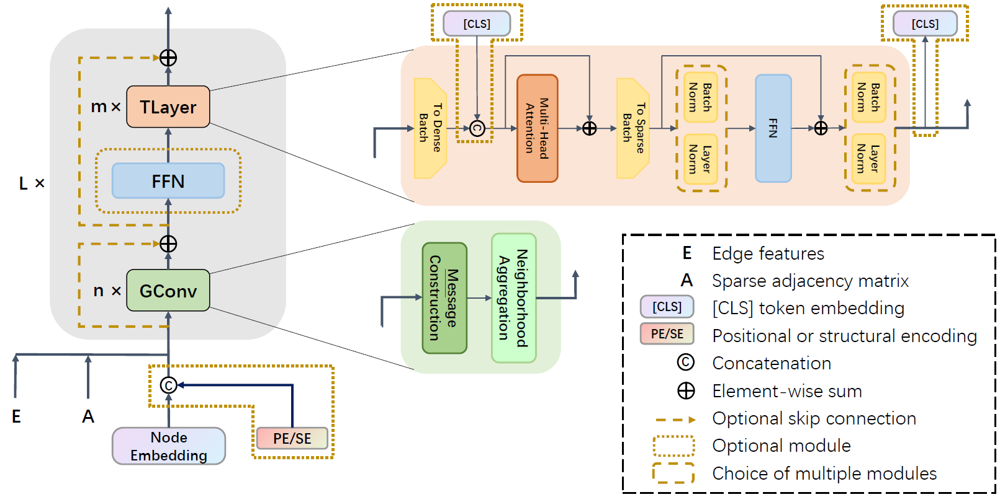
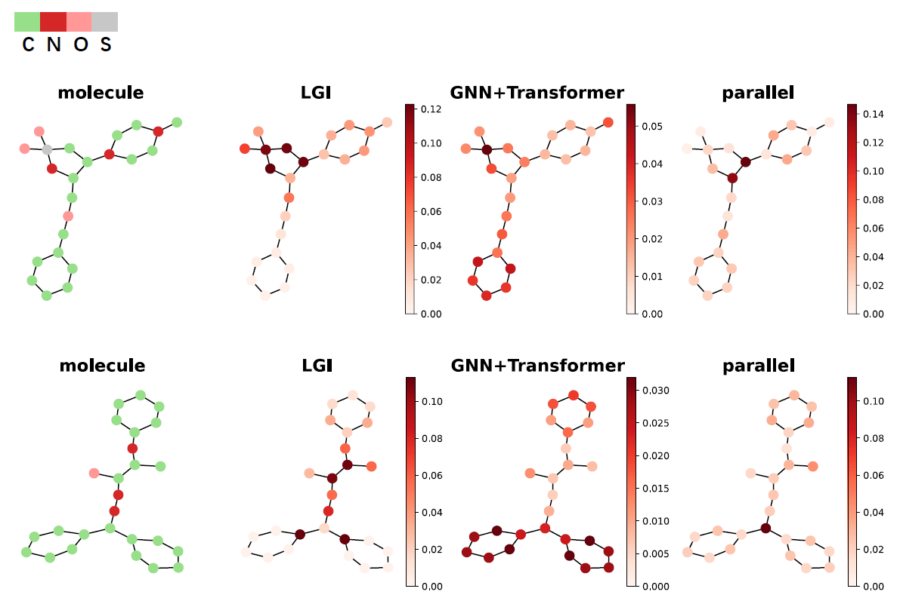
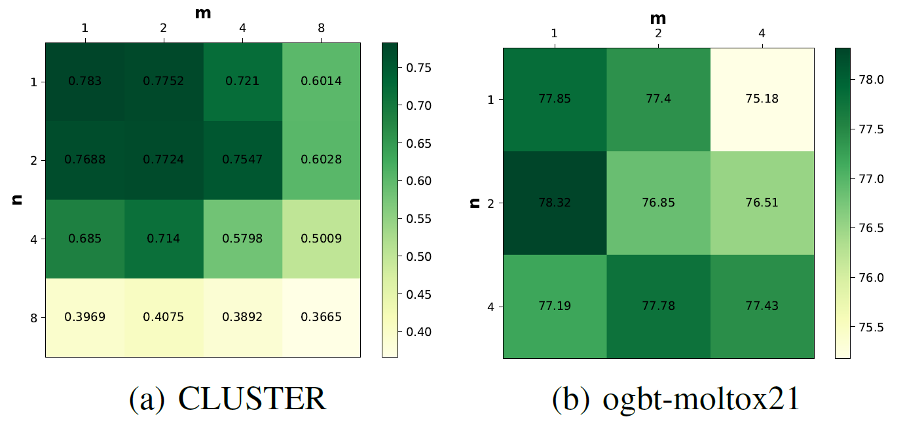
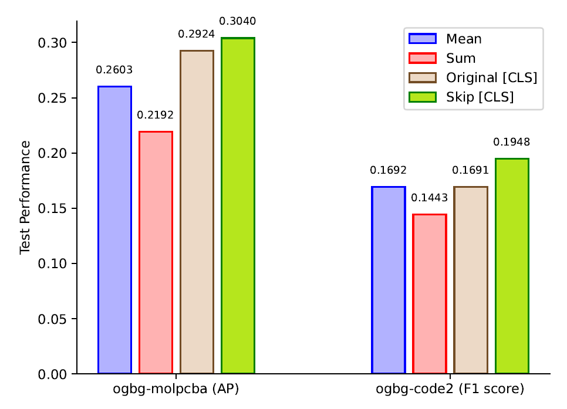

<!--
<style>
img{
    width:80%;
    padding-left: 10%;
}
</style>
-->

# LGI-GT: Graph Transformers with Local and Global Operators Interleaving

We categorize existing graph Transformers into 2 types:
- **Type Ⅰ** combines Transformer encoder with connectivity information and edge features via specially tailored attention computing formulas or graph-related positional encodings (PE/SE). This class of GTs can be regarded as independent of GNNs, e.g., Graphormer, SAN, UniMP and GRPE.
- **Type Ⅱ** explicitly utilizes both of the message passing GNN modules and Transformer encoder layers, such as GraphTrans, SAT and GPS.

Our **LGI-GT** belongs to Type Ⅱ, consisting in an interleaving scheme to construct GTs with local operators and global operators (i.e., GConvs and TLayers, respectively). The model architecure of LGI-GT are as follows:<br/><br/> <br/>

LGI scheme is a general framework, where GConv can be any message passing modules, while TLayer also can be replaced by linear Transformer variants for the sake of low complexity.

If we also use attention-based message passing module as the GConv, then a full-attention LGI-GT comes up. We also propose a novel attention-based GConv --- **Edge Enhanced Local Attention (EELA)**, which is more suitable for the proposed LGI-GT than the previous counterparts like GATConv and TransformerConv.

LGI-GT is built using [PyTorch](https://pytorch.org/) and [PyG](https://www.pyg.org/). Specifically *Pytorch v1.8.0* and *PyG v2.0.4* are required, and package requirements are concluded in `requirements.txt`

Hardwares used are NVIDIA GeForce GTX 1080 Ti, RTX 2080 Ti and RTX 3090.

### Python environment setup

```bash
conda create -n lgi_gt python=3.9
conda activate lgi_gt

# (torch related 'cu' number depends on the version of cuda toolkit installed)
pip install torch==1.8.0+cu111
pip install torch-sparse torch-scatter -f https://data.pyg.org/whl/torch-1.8.0+cu111.html
pip install torch-geometric==2.0.4
pip install ogb==1.3.4
pip install jupyter

```


### Running LGI-GT
```bash

# ZINC
cd zinc
python main.py

# PATTERN
cd pattern
python main.py --num_rw_steps 7 --dim-pe 16 --tlayer-dropout 0.3 --attn-dropout 0.3 --scheduler none

# CLUSTER
cd cluster
python main.py --attn-dropout 0.5 --tlayer-dropout 0.1 --lr 0.001 --num-heads 8 --scheduler cosine

# ogbg-molpcba, also validate the effectiveness of the proposed EELA
cd pcba
python main.py # with EELA as GConv
python main_gat.py # with GATConv as GConv
python main_transformerconv.py # with TransformerConv as GConv

# ogbg-code2
cd code2
python main_segment.py --gconv-dim 256 --tlayer-dim 256 --gconv-dropout 0 --attn-dropout 0 --tlayer-dropout 0.4 --scheduler linear --warmup 5 --lr 0.0002 --readout cls --segment_pooling sum
```

To test with 10 different seeds on each dataset, please run the `.sh` files in the corresponding folders.


### Effectiveness of the LGI scheme  

To further validate the effectiveness of the LGI scheme to construct GT, compared with the GNN+Transformer scheme and parallel scheme, we conducted an additional comparison experiment on 4 smaller datasets inculding NCI1, NCI109, ogbg-molbbbp and ogbg-moltox21.

In each corresponding folder, `g.py` represents GNN, `t.py` represents Transformer, `gnnt.py` represents GNN+Transformer, and `parallel.py` represents GT parallelizing local message passing and global self-attention like GraphGPS.

E.g., for NCI1,

```bash
cd nci1
python main.py --warmup 10 --scheduler linear
python main_g.py --warmup 10 --scheduler linear
python main_t.py --warmup 10 --scheduler linear
python main_gnnt.py --warmup 10 --scheduler linear
python main_parallel.py --warmup 10 --scheduler linear
```

Still, to get a final result with 10 different seeds on each dataset,  please run the `.sh` file in the corresponding folders.

### Depth Study

For validating the robustness of our LGI-GT to the model detph, also compared with the GNN+Transformer scheme and the parallel scheme, we performed depth study on PATTERN.


We increased the depth from 6 to 20, and showed the performance w.r.t. the model depth for these three schemes in a line chart. Results are in `pattern/exp_result`.

### Visualization
See the folder `pcba_cls_attn`, in which `state/LGI.pt` saved parameters of a trained LGI-GT and it is loaded in `visualize.ipynb` to get attention scores for graphs. The code of drawing procedure is in module `visualize_draw.py` which is called by `visualize.ipynb`.
>For the capacity limitation of supplementary material, we only uploaded `LGI.pt` here and exclude parameter files of GNN+Transformer as well as Parallel Transformer

Two visualization examples are as follows: <br/><br/>

## Appendix

### Different Combinations of $n$ and $m$

To explore the influence of different combinations of $n$ and $m$ on LGI-GT, we further performed a study on CLUSTER and ogbg-moltox21, and results are concluded in folders `cluster/exp_result_nm` and `tox21/exp_result_nm`, respectively.
<br/>

### Effectiveness of the Skip Propagating Method for the $[\mathtt{CLS}]$ Token

We compare the performance of LGI-GT models with different readout methods on ogbg-molpcba and ogbg-code2. The results are in folder `skip_cls`.
<br/>
